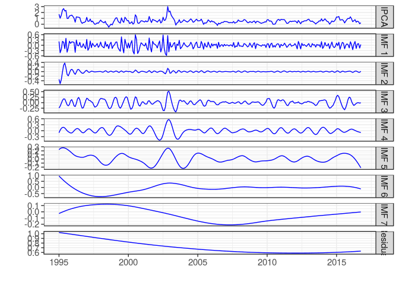
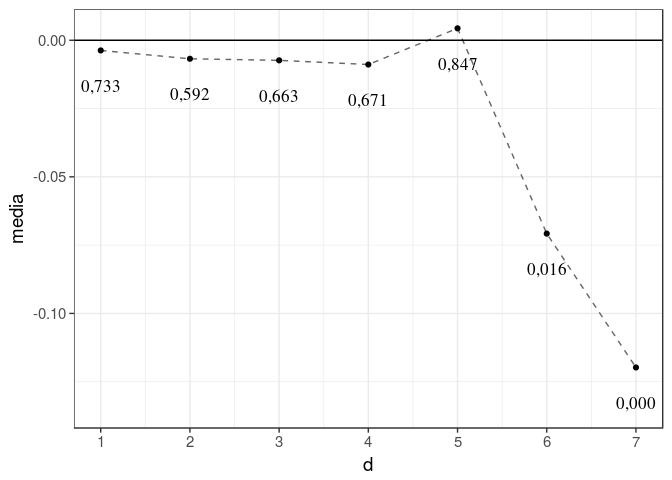
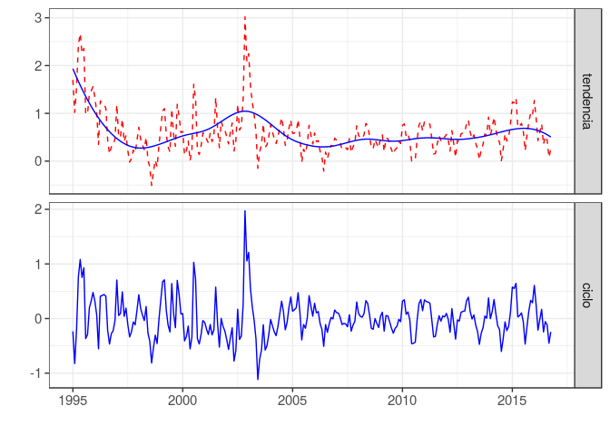
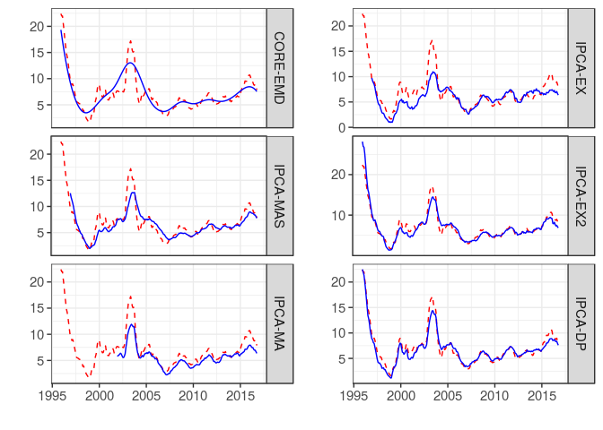
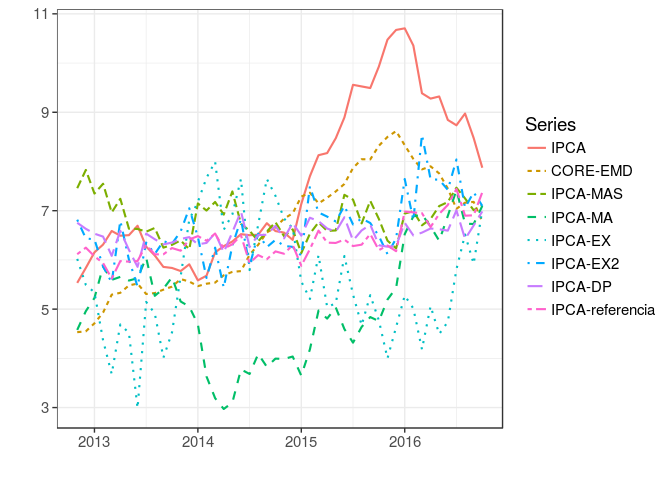

niemd
=====

Núcelo da Inflação como Decomposição de Modo Empírico (EMD)

Tutorial para reproduzir os resultados do artigo "Núcleo da Inflação no
Brasil: uma medida usando a decomposição empírica de modo"

Requisitos técnicos
-------------------

Caso não tenha ainda instalado:

1.  Instale o pacote `devtools` do CRAN com o seguinte comando
    `install.packages("devtools")`.
2.  Programas auxiliares:

-   **Windows:** instale
    [Rtools](http://cran.r-project.org/bin/windows/Rtools/)
-   **Mac:** Instale Xcode no Mac App Store
-   **Linux:** Instale várias bibliotecas de desenvolvimento (detalhes
    variam entre as diferentes distribuições de Linux).

Reproduzindo os resultados
--------------------------

### Figura 2 - IPCA com as IMFs e o resíduo obtidos com CEEMDAN - 1995.1 a 2016.10.

    library(niemd)
    ipca <- ipca95[,"ipca"]
    demd <- Rlibeemd::ceemdan(ipca, noise_strength = 0.4)
    x <- cbind(ipca, demd)
    colnames(x) <- c("IPCA", colnames(demd))
    tsplot(x)

### Tabela 1 – Medidas descritivas das IMFs e do resíduo para o IPCA de 1995.1 a 2016.5

    n <- length(demd[,1])
    ntml <- apply(demd, 2, function(x) length(Rlibeemd::extrema(x)$maxima[,1]))
    pm <- n/ntml
    vari <- apply(demd, 2, var)
    varip <- (vari/var(ipca))*100
    # tabela com os resultados
    tab <- n2tab(cbind(pm, vari, varip), 2)
    tab <- rbind(obs=c(rep("",1), n2tab(var(ipca), 2), ""),
                 tab,
                 soma=c(rep("",2), n2tab(sum(varip), 2)))
    colnames(tab) <- c("Período Médio (mês)",
                       "Variância",
                       "variância como % da variância observada")
    knitr::kable(tab)

<table>
<thead>
<tr class="header">
<th></th>
<th align="left">Período Médio (mês)</th>
<th align="left">Variância</th>
<th align="left">variância como % da variância observada</th>
</tr>
</thead>
<tbody>
<tr class="odd">
<td>obs</td>
<td align="left"></td>
<td align="left">0,23</td>
<td align="left"></td>
</tr>
<tr class="even">
<td>IMF 1</td>
<td align="left">3,05</td>
<td align="left">0,03</td>
<td align="left">13,72</td>
</tr>
<tr class="odd">
<td>IMF 2</td>
<td align="left">4,85</td>
<td align="left">0,00</td>
<td align="left">1,75</td>
</tr>
<tr class="even">
<td>IMF 3</td>
<td align="left">6,72</td>
<td align="left">0,02</td>
<td align="left">8,79</td>
</tr>
<tr class="odd">
<td>IMF 4</td>
<td align="left">11,39</td>
<td align="left">0,02</td>
<td align="left">9,10</td>
</tr>
<tr class="even">
<td>IMF 5</td>
<td align="left">23,82</td>
<td align="left">0,01</td>
<td align="left">5,20</td>
</tr>
<tr class="odd">
<td>IMF 6</td>
<td align="left">43,67</td>
<td align="left">0,09</td>
<td align="left">38,10</td>
</tr>
<tr class="even">
<td>IMF 7</td>
<td align="left">87,33</td>
<td align="left">0,01</td>
<td align="left">5,05</td>
</tr>
<tr class="odd">
<td>Residual</td>
<td align="left">131,00</td>
<td align="left">0,02</td>
<td align="left">7,92</td>
</tr>
<tr class="even">
<td>soma</td>
<td align="left"></td>
<td align="left"></td>
<td align="left">89,64</td>
</tr>
</tbody>
</table>

### Figura 3 - Escolha das IMFs fora da tendência: evolução da média de *u**t* como uma função de *d*.

    # media das reconstrucoes parciais 
    fc <- vector()
    rp <- demd
    for(i in 1:(length(demd[1,])-1)){
      rp[,i]<- apply(as.matrix(demd[,1:i]), 1, sum)
      fc[i] <- mean(rp[,i])
    }

    # teste t
    rpt <- apply(rp, 2, function(x) t.test(x)$p.value)

    library(ggplot2)
    n <- length(demd[1,])
    df <- data.frame(media=fc, rpt=n2tab(rpt[-n]), d=1:(n-1))
    g <- ggplot(df, aes(y = media, x = d)) +
      geom_line(linetype="dashed", alpha=.6) +
      geom_point() + 
      geom_hline(yintercept=0) +
      scale_x_continuous(breaks=1:max(df$d)) +
      geom_text(aes(y=media+.5*mean(media), label=rpt, vjust=0), size=4.5, family="Times", position = "dodge") +
      theme_bw(base_size = 14)
    g

### Figura 4 – Tendência e ciclo extraídos da série IPCA com CEEMDAN, 1995.1 a 2016.10

    core <- apply(as.matrix(demd[,-(1:5)]), 1, sum)
    attributes(core) <- attributes(ipca)
    u <- ipca - core
    x <- cbind(tendencia=core, ciclo=u)
    y <- cbind(ipca, NA)
    tsplot(x, y)

    ## Don't know how to automatically pick scale for object of type yearmon. Defaulting to continuous.

### Figura 5 – IPCA e as medidas de núcleo da inflação (% em 12 meses)

    library(grid)
    library(gridExtra)
    x <- cbind(core, ipca95[,-1])
    colnames(x) <- c("CORE-EMD", "IPCA-MAS", "IPCA-MA", "IPCA-EX", "IPCA-EX2", "IPCA-DP")
    y <- ipca
    p1 <- tsplot(acum(x[,1:3]), acum(y))
    p2 <- tsplot(acum(x[,4:6]), acum(y))
    grid.arrange(p1, p2, ncol = 2)

    ## Don't know how to automatically pick scale for object of type yearmon. Defaulting to continuous.
    ## Don't know how to automatically pick scale for object of type yearmon. Defaulting to continuous.

### Tabela 2 – Testes ADF e KPSS para o IPCA e os núcleos - 1995.1 a 2016.5

    x <- cbind(ipca, core, ipca95[,-1])
    tab <- tab.stationary(acum(x))
    knitr::kable(tab)

<table>
<thead>
<tr class="header">
<th align="left">Variavel</th>
<th align="left">tendencia</th>
<th align="right">ADF.lag</th>
<th align="left">ADF</th>
<th align="left">KPSS</th>
</tr>
</thead>
<tbody>
<tr class="odd">
<td align="left">ipca</td>
<td align="left">sim</td>
<td align="right">14</td>
<td align="left">-3,235*</td>
<td align="left">0,194**</td>
</tr>
<tr class="even">
<td align="left">core</td>
<td align="left">sim</td>
<td align="right">8</td>
<td align="left">-2,870</td>
<td align="left">0,206**</td>
</tr>
<tr class="odd">
<td align="left">ipca95[, -1].ipca.mas</td>
<td align="left">sim</td>
<td align="right">15</td>
<td align="left">-3,001</td>
<td align="left">0,271***</td>
</tr>
<tr class="even">
<td align="left">ipca95[, -1].ipca.ma</td>
<td align="left">sim</td>
<td align="right">14</td>
<td align="left">-2,474</td>
<td align="left">0,538***</td>
</tr>
<tr class="odd">
<td align="left">ipca95[, -1].ipca.ex</td>
<td align="left">sim</td>
<td align="right">14</td>
<td align="left">-2,933</td>
<td align="left">0,199**</td>
</tr>
<tr class="even">
<td align="left">ipca95[, -1].ipca.ex2</td>
<td align="left">sim</td>
<td align="right">14</td>
<td align="left">-3,138*</td>
<td align="left">0,195**</td>
</tr>
<tr class="odd">
<td align="left">ipca95[, -1].ipca.dp</td>
<td align="left">sim</td>
<td align="right">14</td>
<td align="left">-3,478**</td>
<td align="left">0,157**</td>
</tr>
<tr class="even">
<td align="left">diff.ipca</td>
<td align="left">nao</td>
<td align="right">13</td>
<td align="left">-4,448***</td>
<td align="left">0,314</td>
</tr>
<tr class="odd">
<td align="left">diff.core</td>
<td align="left">nao</td>
<td align="right">15</td>
<td align="left">-2,886**</td>
<td align="left">0,657**</td>
</tr>
<tr class="even">
<td align="left">diff.ipca95[, -1].ipca.mas</td>
<td align="left">nao</td>
<td align="right">13</td>
<td align="left">-3,455**</td>
<td align="left">0,326</td>
</tr>
<tr class="odd">
<td align="left">diff.ipca95[, -1].ipca.ma</td>
<td align="left">nao</td>
<td align="right">13</td>
<td align="left">-4,309***</td>
<td align="left">0,066</td>
</tr>
<tr class="even">
<td align="left">diff.ipca95[, -1].ipca.ex</td>
<td align="left">nao</td>
<td align="right">13</td>
<td align="left">-3,986***</td>
<td align="left">0,161</td>
</tr>
<tr class="odd">
<td align="left">diff.ipca95[, -1].ipca.ex2</td>
<td align="left">nao</td>
<td align="right">13</td>
<td align="left">-4,231***</td>
<td align="left">0,592**</td>
</tr>
<tr class="even">
<td align="left">diff.ipca95[, -1].ipca.dp</td>
<td align="left">nao</td>
<td align="right">13</td>
<td align="left">-4,040***</td>
<td align="left">0,441*</td>
</tr>
</tbody>
</table>

### Tabela 3 – Critérios de avaliação dos núcleos da inflação

    x <- cbind(core, ipca95[,-1])
    tab <- tab.marques(y=acum(ipca), x=acum(x))
    knitr::kable(tab)

<table>
<thead>
<tr class="header">
<th align="left">nucleos</th>
<th align="left">ADF</th>
<th align="left">t.alpha</th>
<th align="left">t.gamma</th>
<th align="left">t.lambda</th>
<th align="left">F.thetas</th>
</tr>
</thead>
<tbody>
<tr class="odd">
<td align="left">core</td>
<td align="left">-4,081***</td>
<td align="left">0,572</td>
<td align="left">0,000</td>
<td align="left">0,174</td>
<td align="left">0,129</td>
</tr>
<tr class="even">
<td align="left">ipca95[, -1].ipca.mas</td>
<td align="left">-2,748*</td>
<td align="left">0,226</td>
<td align="left">0,096</td>
<td align="left">0,397</td>
<td align="left">0,000</td>
</tr>
<tr class="odd">
<td align="left">ipca95[, -1].ipca.ma</td>
<td align="left">-4,031***</td>
<td align="left">0,006</td>
<td align="left">0,001</td>
<td align="left">0,039</td>
<td align="left">0,044</td>
</tr>
<tr class="even">
<td align="left">ipca95[, -1].ipca.ex</td>
<td align="left">-1,688</td>
<td align="left">0,306</td>
<td align="left">0,346</td>
<td align="left">0,249</td>
<td align="left">0,001</td>
</tr>
<tr class="odd">
<td align="left">ipca95[, -1].ipca.ex2</td>
<td align="left">-3,185**</td>
<td align="left">0,136</td>
<td align="left">0,054</td>
<td align="left">0,795</td>
<td align="left">0,013</td>
</tr>
<tr class="even">
<td align="left">ipca95[, -1].ipca.dp</td>
<td align="left">-2,237</td>
<td align="left">0,354</td>
<td align="left">0,370</td>
<td align="left">0,875</td>
<td align="left">0,091</td>
</tr>
</tbody>
</table>

### Figura 6 – IPCA e previsões fora da amostra usando as medidas de núcleo, 2012.11 a 2016.10.

    # Previsao fora da amostra

    cores <- x
    cores <- acum(cores)
    ipca12 <- acum(ipca)

    library(zoo)

    ## 
    ## Attaching package: 'zoo'

    ## The following objects are masked from 'package:base':
    ## 
    ##     as.Date, as.Date.numeric

    out12.mdd <- vector("list")
    for(i in 1:ncol(cores)){
      out12.mdd[[i]] <- outsample.mdd(yh=ipca12, yt=ipca12, x=cores[ ,i], m=6, p=6, n=48, h=12)
    }
    out12.mdd[[i+1]] <- outsample.mdd(yh=ipca12, yt=ipca12, x=NULL, m=6, p=6, n=48, h=12)

    # matriz de dados com as previsoes
    x <-sapply(out12.mdd, function(x) x$fcast)
    atr <- tsp(out12.mdd[[1]]$fcast)
    x <- ts(x, start = atr[1], end = atr[2], frequency = atr[3])

    # ipca em 12 meses no periodo fora da amostra
    ipca12 <- window(acum(ipca), start=start(x), end=end(x))

    colnames(x) <- c("core", colnames(ipca95[,-1]), "benchmark")
    dados <- cbind(ipca12, x)

    colnames(dados) <-c("IPCA", "CORE-EMD", "IPCA-MAS", "IPCA-MA", "IPCA-EX", "IPCA-EX2", "IPCA-DP", "IPCA-referencia")
    tsplot(dados, facet = F)

    ## Don't know how to automatically pick scale for object of type yearmon. Defaulting to continuous.

### Tabela 4 – Desempenho preditivo fora da amostra das medidas de núcleo para um horizonte de 12 meses à frente, 2012.11 a 2016.10.

    dados <- cbind(ipca12, x)
    tab1 <- tab.reqm(dados, obs = "ipca12", ref = "x.benchmark")
    tab2 <- tab.enctest(dados, obs = "ipca12", ref = "x.benchmark")
    tab <- cbind(tab1[,-3], c("",tab2[,3]))
    knitr::kable(tab)

<table>
<thead>
<tr class="header">
<th></th>
<th align="left">reqm</th>
<th align="left">eqmr</th>
<th></th>
</tr>
</thead>
<tbody>
<tr class="odd">
<td>x.benchmark</td>
<td align="left">1,84</td>
<td align="left">1,00</td>
<td></td>
</tr>
<tr class="even">
<td>x.core</td>
<td align="left">1,19</td>
<td align="left">0,42</td>
<td>1,21 (0,00)</td>
</tr>
<tr class="odd">
<td>x.ipca.mas</td>
<td align="left">1,77</td>
<td align="left">0,92</td>
<td>-0,92 (0,21)</td>
</tr>
<tr class="even">
<td>x.ipca.ma</td>
<td align="left">2,85</td>
<td align="left">2,38</td>
<td>0,42 (0,30)</td>
</tr>
<tr class="odd">
<td>x.ipca.ex</td>
<td align="left">2,98</td>
<td align="left">2,62</td>
<td>-0,65 (0,06)</td>
</tr>
<tr class="even">
<td>x.ipca.ex2</td>
<td align="left">1,63</td>
<td align="left">0,78</td>
<td>1,01 (0,00)</td>
</tr>
<tr class="odd">
<td>x.ipca.dp</td>
<td align="left">1,87</td>
<td align="left">1,02</td>
<td>-1,38 (0,19)</td>
</tr>
</tbody>
</table>
